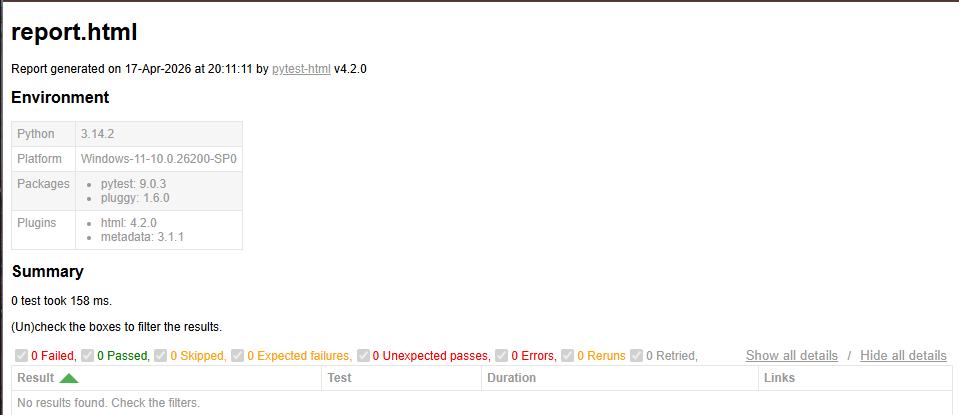

# api-automation-framework
Python-based API automation framework using Pytest with logging, reporting, and reusable architecture.

# 🚀 Nexus API Testing Framework

A scalable, production-style API automation framework built using Python and Pytest.  
Designed to demonstrate real-world QA automation skills including API testing, reusable architecture, logging, and reporting.

---

## 📌 Overview

The Nexus API Testing Framework automates REST API validation using clean engineering principles. It focuses on API automation using a reusable client design, scalable test architecture, structured logging for debugging, HTML reporting for execution visibility, and maintainable framework structure suitable for enterprise environments.

---

## 🏗️ Project Structure

api-automation-framework/
│
├── tests/
│   └── test_users.py
│
├── utils/
│   ├── api_client.py
│   ├── config.py
│   └── logger.py
│
├── reports/
│   ├── report.html
│   └── test.log
│
├── requirements.txt
├── pytest.ini
└── README.md

---

## ⚙️ Tech Stack

Python 3.x, Pytest, Requests, pytest-html, and Python logging.

---

## 🚀 Features

- REST API automation (GET, POST, DELETE)
- Reusable API client abstraction layer
- Centralized configuration management
- Structured logging system for debugging
- HTML test reporting
- Scalable and modular framework design

---

## 📦 Installation

Clone the repository:

git clone https://github.com/YOUR_USERNAME/nexus-api-testing-framework.git  
cd nexus-api-testing-framework  

Install dependencies:

pip install -r requirements.txt  

---

## ▶️ Running Tests

Run all tests:

python -m pytest  

Run with HTML report:

python -m pytest --html=reports/report.html --self-contained-html  

---

## 🧪 Sample Test Case

from utils.api_client import APIClient  
from utils.logger import get_logger  

logger = get_logger()  

def test_get_products():  
    response = APIClient.get(  
        "/collections/products/records",  
        params={"project_id": 13531}  
    )  

    logger.info("GET products API called")  

    assert response.status_code == 200  

    data = response.json()  
    assert isinstance(data, dict)  

---

## 🔗 API Client (Core Layer)

import requests  
from utils.config import BASE_URL, TIMEOUT, API_KEY  

class APIClient:  

    headers = {  
        "x-api-key": API_KEY  
    }  

    @staticmethod  
    def get(endpoint, params=None):  
        return requests.get(  
            f"{BASE_URL}{endpoint}",  
            headers=APIClient.headers,  
            params=params,  
            timeout=TIMEOUT  
        )  

    @staticmethod  
    def post(endpoint, payload):  
        return requests.post(  
            f"{BASE_URL}{endpoint}",  
            json=payload,  
            headers=APIClient.headers,  
            timeout=TIMEOUT  
        )  

    @staticmethod  
    def delete(endpoint):  
        return requests.delete(  
            f"{BASE_URL}{endpoint}",  
            headers=APIClient.headers,  
            timeout=TIMEOUT  
        )  

---

## ⚙️ Configuration

BASE_URL = "https://reqres.in/api"  
API_KEY = "your_api_key_here"  
TIMEOUT = 5  

---

## 🪵 Logging Utility

import logging  

def get_logger():  
    logger = logging.getLogger("API_Automation")  
    logger.setLevel(logging.INFO)  

    if not logger.handlers:  
        handler = logging.FileHandler("reports/test.log")  
        formatter = logging.Formatter("%(asctime)s - %(levelname)s - %(message)s")  
        handler.setFormatter(formatter)  
        logger.addHandler(handler)  

    return logger  

---

## 📊 Reports

HTML test reports are generated at:

reports/report.html  

They include:
- Test execution summary  
- Pass/fail status  
- Execution details per test case  

---

## 📸 Test Execution Report

### HTML Test Report

Below is an example of the automated test report generated after execution:

### CI Pipeline

Every push triggers automated test execution via GitHub Actions:

---

## 🧠 What This Project Demonstrates

This framework demonstrates API automation engineering, reusable architecture design, real-world testing patterns, debugging with logging, and scalable QA automation practices used in enterprise environments.

---

## 📈 Future Improvements

- CI/CD integration using GitHub Actions  
- Docker containerization  
- Data-driven testing (JSON/CSV inputs)  
- OAuth2 / JWT authentication support  
- Parallel test execution  
- Allure reporting integration  

---

## 👨‍💻 Author

Desiree D’Mello  
Full-Stack Engineer | QA Automation | AI Enthusiast  

---
